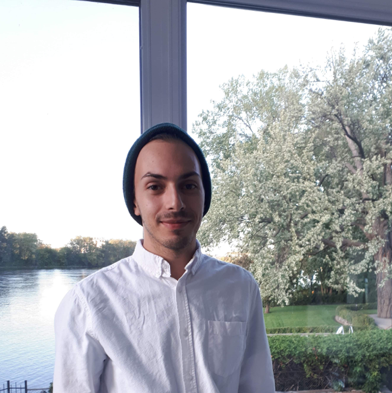

---
# Feel free to add content and custom Front Matter to this file.
# To modify the layout, see https://jekyllrb.com/docs/themes/#overriding-theme-defaults

layout: home
title: Home
order: 1
---

Hello and welcome to my website! 

## About me

I'm currently a Master's student at [McGill University](https://www.cs.mcgill.ca/) and [Mila](https://mila.quebec/en/) researching applications and extensions of natural language processing (NLP) to the field of medicine. I am supervised by [Prof. Jackie Cheung](https://www.cs.mcgill.ca/~jcheung/index.html) and [Prof. Samira Rahimi](https://rahimislab.ca/). We are working on ways of integrating recent advances in NLP to different medical settings such as refining medical diagnoses and improving the quality of primary care.

I am also a data analyst at the [Research Centre of Sainte-Justine University Hospital](https://research.chusj.org/en/Home) where I most recently collaborated with [Dr. Nicholas Chadi](https://nicholaschadi.com/) and [Dr. Olivier Drouin](https://www.chusj.org/Bio?id=8ee23644-25f9-4390-9283-4e487766971b&lang=en) on studying mental health-related emergency department visits ([more here](https://pubmed.ncbi.nlm.nih.gov/34462192/#affiliation-2)).
 
 
I hold a Bachelor's degree in Mathematics, Statistics and Computer Science from Concordia University.