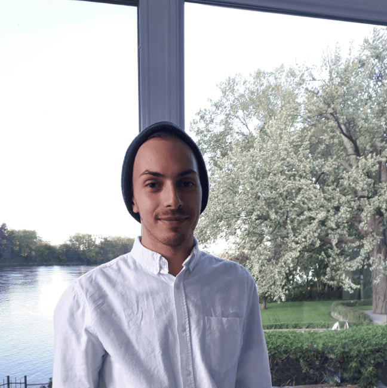

---
# Feel free to add content and custom Front Matter to this file.
# To modify the layout, see https://jekyllrb.com/docs/themes/#overriding-theme-defaults

layout: home
title: Home
order: 1
---

Hello and welcome to my website! 

## About me

<!-- 

 -->

    

 

I'm a PhD student at [McGill University](https://www.cs.mcgill.ca/) and [Mila](https://mila.quebec/en/) where I am advised by [Prof. Jackie Cheung](https://www.cs.mcgill.ca/~jcheung/index.html). I am currently interested in computational pragmatics and world models.

Before starting my PhD, I earned a master's degree in Computer Science from [McGill University](https://www.cs.mcgill.ca/) where I worked with Prof. Cheung along with [Prof. Samira Rahimi](https://rahimislab.ca/) on leveraging NLP techniques to assist health researchers in their analysis of patient-care data. Before my master's, I earned a bachelor's degree in Mathematics, Statistics and Computer Science (Joint Major) from [Concordia University](https://www.concordia.ca/).

In terms of research services, I am currently an organizer for the McGill NLP [reading group](https://mcgill-nlp.github.io/reading-group/) (really more of a seminar series). Before that, I was the organizer of the Mila Health and AI reading group (March 2022 to March 2023).

## Recent News

- **July and August 2025**: During my trip to ACL 2025, I visited [Prof. Vera Demberg's group](https://www.uni-saarland.de/lehrstuhl/demberg/members/verademberg.html) at Saarland University and [Prof. Hinrich Schütze's group](https://cisnlp.github.io/) at LMU Munich and give talks about **Capturing Intentions withing Figurative Language**. I didn't record my talks while I was there, so [I have recorded it and posted it to my YouTube channel](https://youtu.be/bT4GFN19TBo).

- **June 2025**: New paper *$$(RSA)^2$$: A Rhetorical-Strategy-Aware Rational Speech Act Framework for Figurative Language Understanding* to appear at ACL 2025 (Main) is out and can be found [here](https://arxiv.org/abs/2506.09301). We're also presenting this work at SCiL 2025; a shorter abstract can be found [here](https://openpublishing.library.umass.edu/scil/article/id/3171/).

- **November 2024**: I presented my paper *Does This Summary Answer My Question? Modeling Query-Focused Summary Readers with Rational Speech Acts* as a poster at the [CustomNLP4U Workshop](https://customnlp4u-24.github.io/) at EMNLP 2024. Poster and paper can be found [here](https://github.com/cesare-spinoso/RSASumm-CustomNLP4U).

- **July 2024**: Better late than never! I have made a [webpage]({{ "teaching/comp330/fall2023" | relative_url }}) for the Comp 330 (Theory of Computation) class I taught in the Fall 2023. Resources like lecture notes and assignments are now publicly accessible! This compliments a [previous post]({{ "2023/12/14/my_experience_teaching.html" | relative_url }}) I made recounting my teaching experience.

- **May 2024**: I gave a lecture on NLP to the 2024 cohort of [AI4Good](https://www.ai4goodlab.com/) students!

