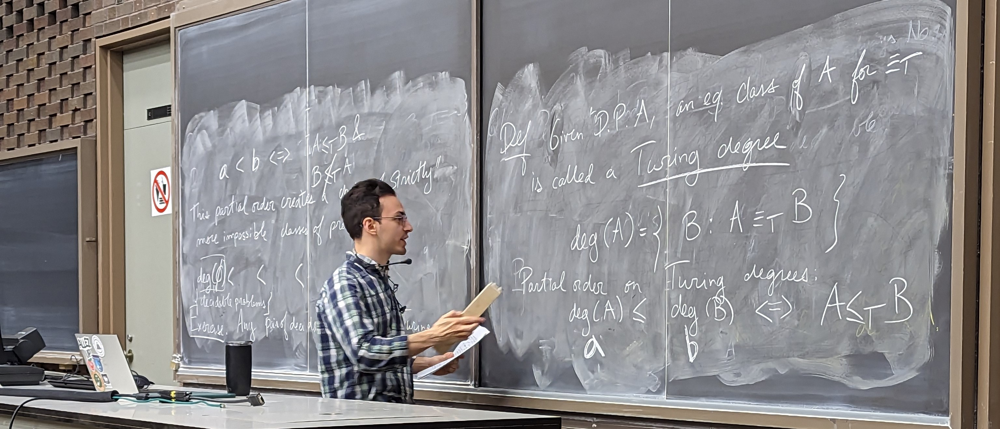
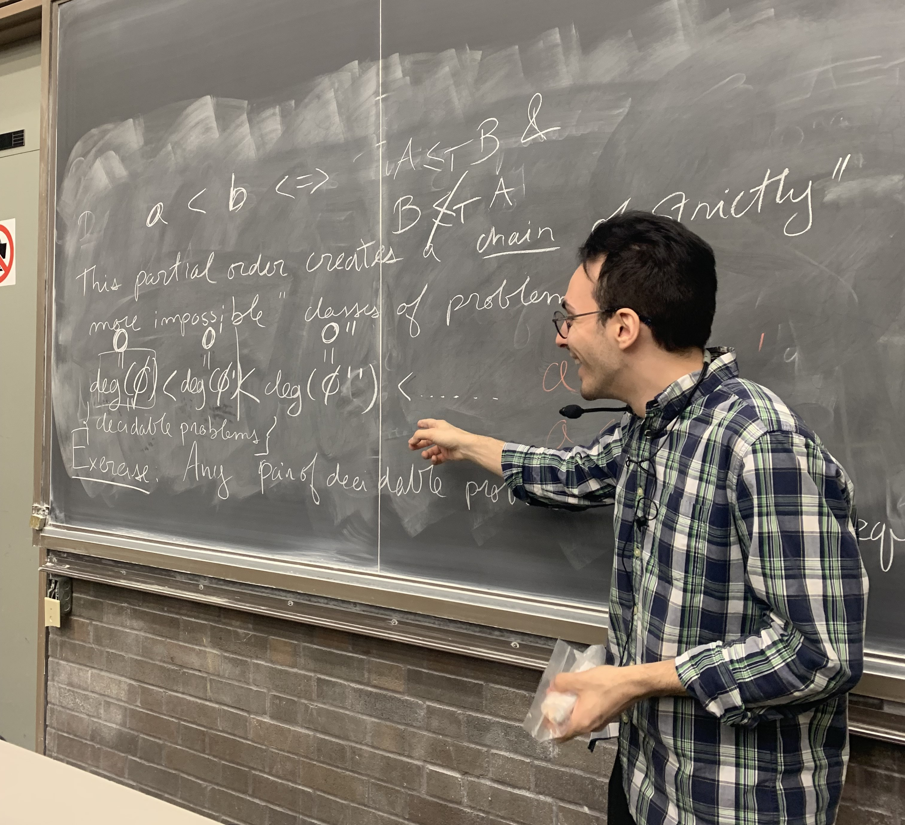

I loved every second that I was a teacher for COMP 330. Here are some moments I am particularly fond of:

- Landing my _first joke_ during Lecture 1. I won't spoil it, but it had something to do with my name...
- The introduction of the _italian expressions_ at the beginning of every lecture. Around Week 3 or 4, I decided that I would start every lecture by telling the class an italian expression. This idea was inspired by one of my favourite lecturers, Prakash, who usually starts his lectures by recounting some important historical facts. The first expression was `Basta la pasta` and the last one was `Un pezzo di pane`.
- The implementation of _granola bar_ office hours. This was also inspired by another one of my favourite lecturers, Nancy Acemian, who used to give out snacks during her office hours. I thought I would give it a shot and I'm happy to report that some undergrads went a little less hungry during the semester because of [Quaker](https://www.costco.ca/quaker-yogurt-granola-bars%2C-34-%C3%97-35-g.product.100504958.html).
- Reading the midterm evaluations. I was elated to know that some students were enjoying the class and that my explanations were making sense. I was doubly enthused by the number of people who did well on the midterm.
- Giving _two_ blackboard lectures. The first one was unplanned (the S1/4 projector was being capricious), but still enjoyable (to me at least!). The second one which I held during the last lecture was very much planned. I used [Hagoromo](https://hagoromo.shop/) chalk.
- Taking a _class picture_ with the students at the end of my last lecture. Because I don't want to violate anyone's privacy, I will not post it here. Instead, here are a few pictures that my friend, Ian Porada, and a student took of me during my last lecture.

**Picture 1:** Me quickly erasing the board. I was rushing through content as I was trying to show the students the incredibly cool _infinite chain of increasingly more impossible problems_.

**Picture 2:** Me very happily pointing at this _infinite chain of increasingly more impossible problems_. I had talked about this during Lecture 1 and so I was extremely happy to finish the class having come full circle.

Overall, teaching has been a wonderful experience. It is a privilege to be a part of other people's education. I hope to do it again in the future!
